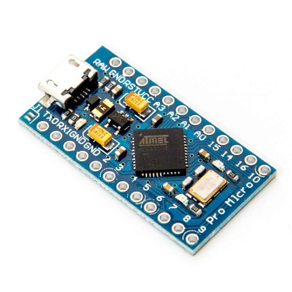
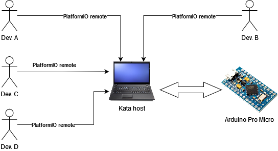
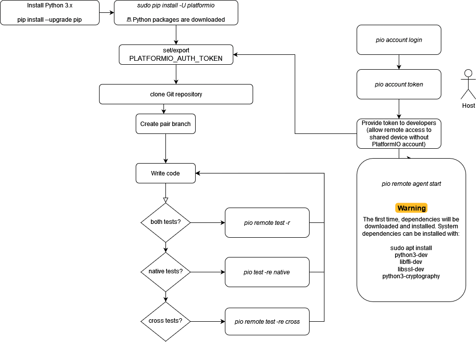

# Powerbank Charge Indicator Kata

## Analysis of target environment

The software is developped for a Arduino Pro Micro : 

Four LEDs are connected to the board, on pins 6, 7, 8 and 9. LEDS are ON when the PIN reads 8. It means board will `sink` (and not `source`) the current to the LEDs.

The target board is powered by a [Atmel/Microchip ATmega32U4 MCU](https://www.microchip.com/en-us/product/ATmega32U4). Code for that MCU can be produced using the Open Source [AVR toochain](https://www.nongnu.org/avr-libc/).
> AVR toolchain can be installed manually or through the preffered PlatformIO environment.

## Development environment

For the Kata, only one board will be available. To allow each participant to code, `PlatformIO` allow to remotely send code to the board. Diagram below provides information :

* The kata host shall `pio login` with an existing `platformIO` account. Then,  `pio account token` will give a token, useable by each developer for code upload. Once ready, `sudo pio remote agent start` will start the hardware sharing service. At this point, the kata host should not be manipulated during the kata.

> In this environment, each developer (or pair) can use the same target hardware. **No toolchain is needed on developers machine since they will be available on host machine**.

## Development process overview

## Development strategies

Two environments are provided: `native` and `cross`. Below are some different development strategies which can be used for this kata.

### Business logic first
The business logic shall be first implemented for the `native` environment, using a test double for the hardware parts. Tests can be run on the `native` environment only. Once tests are green, the hardware components shall be developped and tested on the `cross` environment.

### Global flow
All needed code is written and tested on both platform using small steps.

### Cross only
Written code losts compatibility on `native` environment, and only rely on distant `cross` toolchain.
